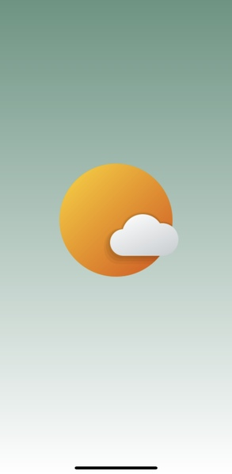
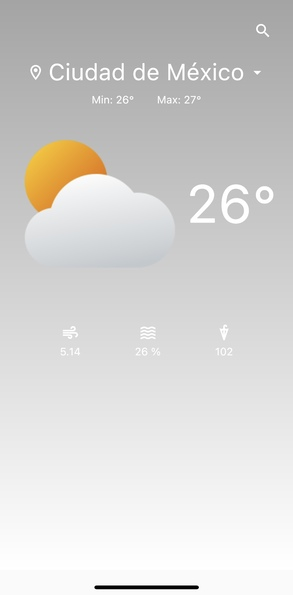
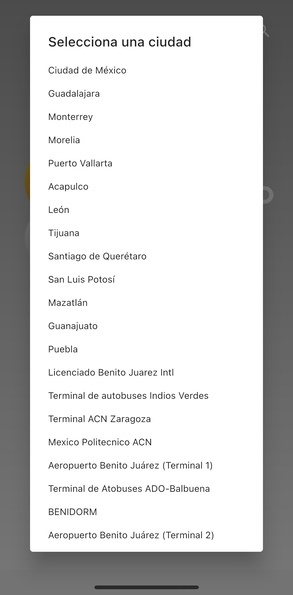

# Weather

A Flutter Weather app

## OS
1. Android
2. IOS

## Language Application Support
Spanish and English

## Framework and language
1. Flutter v- 3.3.2
2. Dart

## Libraries
1. get
2. http
3. modal_progress_hud_nsn
4. cached_network_image
5. flutter_launcher_icons

## API's

https://api.openweathermap.org

### Get Weather
``` javascript
fetch('https://api.openweathermap.org/data/2.5/weather')
            .then(res=>res.json())
            .then(json=>console.log(json))
```

## Authors
- [@IvanZeroi96](https://github.com/IvanZeroi96)

## Donate
[](https://www.paypal.com/paypalme/IvanZeroi)

## Boost
You can support me by doing "☆ Star" in the repo or push me to "GitHub Star".

[](https://stars.github.com/nominate/)

## Images


